# 🏗️ Enterprise System Architecture Documentation

## 📋 Executive Summary

The Chat Rooms Application represents a state-of-the-art, enterprise-grade real-time communication platform built on modern architectural principles. This system leverages hexagonal architecture, microservices design patterns, cloud-native infrastructure, and enterprise security frameworks to deliver scalable, secure, and highly available messaging services.

### 🎯 Architectural Objectives

- **Scalability**: Handle 100,000+ concurrent users with horizontal scaling
- **Security**: Enterprise-grade security with SOC 2 Type II compliance
- **Reliability**: 99.9% uptime SLA with automated failover
- **Performance**: Sub-100ms message delivery with global CDN
- **Maintainability**: Clean architecture with comprehensive testing (>90% coverage)

## 🌐 High-Level Enterprise Architecture

```mermaid
graph TB
    subgraph "🌐 Global Infrastructure"
        CDN[CloudFront CDN<br/>📡 Global Edge Locations]
        WAF[AWS WAF<br/>🛡️ Web Application Firewall]
        ALB[Application Load Balancer<br/>⚖️ Multi-AZ Distribution]
    end
    
    subgraph "👥 Client Ecosystem"
        WebApp[Vue 3 SPA<br/>🖥️ Progressive Web App]
        Mobile[React Native<br/>📱 iOS/Android]
        API_Clients[Third-party Integrations<br/>🔌 REST/GraphQL APIs]
        Desktop[Electron Desktop<br/>💻 Cross-platform]
    end
    
    subgraph "🏢 Application Services Layer"
        subgraph "🚪 API Gateway"
            Gateway[Kong Gateway<br/>🌉 Rate Limiting & Auth]
        end
        
        subgraph "💼 Core Services"
            AuthSvc[Authentication Service<br/>🔐 OAuth2/OIDC]
            ChatSvc[Chat Service<br/>💬 Message Processing]
            UserSvc[User Management<br/>👤 Profile & Preferences]
            NotifSvc[Notification Service<br/>🔔 Push/Email/SMS]
            FileSvc[File Management<br/>📁 Upload/Storage]
        end
        
        subgraph "⚡ Real-time Layer"
            WSGateway[WebSocket Gateway<br/>🔄 Socket.io Cluster]
            EventBus[Event Bus<br/>🚌 Redis Pub/Sub]
        end
    end
    
    subgraph "💾 Data & Storage Layer"
        subgraph "🗄️ Primary Database"
            MongoDB_Primary[MongoDB Primary<br/>📊 Replica Set Leader]
            MongoDB_Secondary[MongoDB Secondary<br/>📋 Read Replicas]
        end
        
        subgraph "⚡ Caching Layer"
            Redis_Cache[Redis Cache<br/>🏃 Session Storage]
            Redis_Queue[Redis Queue<br/>📝 Message Queue]
        end
        
        subgraph "📦 Object Storage"
            S3_Primary[S3 Primary<br/>🗂️ File Storage]
            S3_Backup[S3 Backup<br/>💾 Cross-region Backup]
        end
    end
    
    subgraph "🔍 Observability & Monitoring"
        Prometheus[Prometheus<br/>📊 Metrics Collection]
        Grafana[Grafana<br/>📈 Dashboards]
        ElasticStack[ELK Stack<br/>📋 Centralized Logging]
        Jaeger[Jaeger<br/>🔍 Distributed Tracing]
    end
    
    subgraph "☁️ Infrastructure Layer"
        K8s[Kubernetes Cluster<br/>⚙️ Container Orchestration]
        Docker[Docker Registry<br/>📦 Container Images]
        Terraform[Terraform<br/>🏗️ Infrastructure as Code]
        AWS[AWS Services<br/>☁️ Cloud Provider]
    end
    
    %% Client connections
    WebApp --> CDN
    Mobile --> CDN
    API_Clients --> CDN
    Desktop --> CDN
    
    %% Security layer
    CDN --> WAF
    WAF --> ALB
    
    %% Load balancer to gateway
    ALB --> Gateway
    
    %% Gateway to services
    Gateway --> AuthSvc
    Gateway --> ChatSvc
    Gateway --> UserSvc
    Gateway --> NotifSvc
    Gateway --> FileSvc
    Gateway --> WSGateway
    
    %% Service interconnections
    ChatSvc --> EventBus
    WSGateway --> EventBus
    AuthSvc --> Redis_Cache
    
    %% Data connections
    ChatSvc --> MongoDB_Primary
    UserSvc --> MongoDB_Primary
    MongoDB_Primary --> MongoDB_Secondary
    
    %% Cache connections
    WSGateway --> Redis_Cache
    ChatSvc --> Redis_Queue
    
    %% Storage connections
    FileSvc --> S3_Primary
    S3_Primary --> S3_Backup
    
    %% Monitoring connections
    K8s --> Prometheus
    Prometheus --> Grafana
    K8s --> ElasticStack
    K8s --> Jaeger
    
    %% Infrastructure
    Gateway --> K8s
    AuthSvc --> K8s
    ChatSvc --> K8s
    UserSvc --> K8s
    NotifSvc --> K8s
    FileSvc --> K8s
    WSGateway --> K8s
    
    classDef clientStyle fill:#e1f5fe,stroke:#0277bd,stroke-width:2px
    classDef serviceStyle fill:#f3e5f5,stroke:#7b1fa2,stroke-width:2px
    classDef dataStyle fill:#e8f5e8,stroke:#2e7d32,stroke-width:2px
    classDef infraStyle fill:#fff3e0,stroke:#ef6c00,stroke-width:2px
    classDef monitorStyle fill:#fce4ec,stroke:#c2185b,stroke-width:2px
    
    class WebApp,Mobile,API_Clients,Desktop clientStyle
    class Gateway,AuthSvc,ChatSvc,UserSvc,NotifSvc,FileSvc,WSGateway,EventBus serviceStyle
    class MongoDB_Primary,MongoDB_Secondary,Redis_Cache,Redis_Queue,S3_Primary,S3_Backup dataStyle
    class K8s,Docker,Terraform,AWS infraStyle
    class Prometheus,Grafana,ElasticStack,Jaeger monitorStyle
```



## 🎯 Architectural Principles

### 🔷 Hexagonal Architecture (Ports & Adapters)

Our system implements clean hexagonal architecture with clear separation of concerns:

```mermaid
graph LR
    subgraph "🌐 External Adapters"
        REST[REST Controllers<br/>🔌 HTTP Interface]
        WS[WebSocket Handlers<br/>⚡ Real-time Interface]
        GQL[GraphQL Resolvers<br/>🔗 Flexible Queries]
    end
    
    subgraph "💼 Application Core"
        UC[Use Cases<br/>🎯 Business Logic]
        DOM[Domain Models<br/>🏗️ Core Entities]
        SERV[Domain Services<br/>⚙️ Business Rules]
    end
    
    subgraph "🗄️ Infrastructure Adapters"
        MONGO[MongoDB Adapter<br/>📊 Data Persistence]
        REDIS[Redis Adapter<br/>⚡ Caching Layer]
        S3[S3 Adapter<br/>📁 File Storage]
        EMAIL[Email Adapter<br/>📧 Notifications]
    end
    
    REST --> UC
    WS --> UC
    GQL --> UC
    
    UC --> DOM
    UC --> SERV
    
    UC --> MONGO
    UC --> REDIS
    UC --> S3
    UC --> EMAIL
```



### 🚀 Microservices Design Patterns

#### 📋 Service Decomposition Strategy

| Service | Responsibility | Technology Stack | Scaling Strategy |
|---------|---------------|------------------|------------------|
| **Authentication** | User identity, sessions, RBAC | NestJS, Passport, JWT | Horizontal (Stateless) |
| **Chat Management** | Message processing, rooms | NestJS, Socket.io, MongoDB | Horizontal + Sharding |
| **User Management** | Profiles, preferences, contacts | NestJS, MongoDB, Redis | Horizontal |
| **Notification** | Push, email, SMS delivery | NestJS, AWS SES/SNS | Queue-based scaling |
| **File Management** | Upload, processing, storage | NestJS, Multer, S3 | Horizontal |
| **Analytics** | Usage metrics, reporting | Node.js, ClickHouse | Read replicas |

#### 🔄 Inter-Service Communication


    H --> L
    I --> J
    F --> M
    G --> M
    H --> M
    M --> N
    M --> O
```

## Hexagonal Architecture (Backend)


## Frontend Architecture (Vue 3)


## Infrastructure Architecture (AWS/Kubernetes)


## Data Flow Architecture


## Security Architecture


## Deployment Architecture


## Monitoring & Observability


## Component Dependencies


## Technology Stack Overview

| Layer | Technology | Purpose |
|-------|------------|---------|
| **Frontend** | Vue 3 + TypeScript | Reactive user interface |
| **State Management** | Pinia | Centralized state management |
| **Build Tool** | Vite | Fast development and building |
| **Backend** | NestJS + TypeScript | Scalable server-side application |
| **Database** | MongoDB | Document-based data storage |
| **Cache** | Redis | High-performance caching |
| **Real-time** | Socket.io | WebSocket communication |
| **Authentication** | JWT | Stateless authentication |
| **Containerization** | Docker | Application containerization |
| **Orchestration** | Kubernetes | Container orchestration |
| **Cloud** | AWS | Cloud infrastructure |
| **IaC** | Terraform | Infrastructure as Code |
| **Monitoring** | Prometheus + Grafana | Metrics and visualization |
| **Logging** | ELK Stack | Centralized logging |
| **Tracing** | Jaeger | Distributed tracing |
| **CI/CD** | GitHub Actions | Automated deployment |

## Performance Considerations

### Scalability Patterns

- **Horizontal Scaling**: Multiple API instances behind load balancer
- **Database Sharding**: User-based sharding for MongoDB
- **Cache Strategy**: Redis for session storage and frequent queries
- **CDN**: Static asset delivery via CloudFront

### Performance Optimizations

- **Code Splitting**: Lazy loading of Vue components
- **Tree Shaking**: Elimination of unused code
- **Compression**: Gzip/Brotli compression for assets
- **Database Indexing**: Optimized queries with proper indexes
- **Connection Pooling**: Efficient database connections

### Monitoring Metrics

- **Response Time**: API endpoint response times
- **Throughput**: Requests per second
- **Error Rate**: 4xx/5xx error percentages
- **Resource Usage**: CPU, memory, disk utilization
- **WebSocket Connections**: Active connection count
- **Message Latency**: Real-time message delivery time

This architecture supports high availability, scalability, and maintainability while following enterprise-grade best practices.
