# 🚀 Enterprise Development Guide

## 📋 Overview

This comprehensive development guide provides enterprise-grade development practices, standards, and procedures for the Chat Rooms Application. Following these guidelines ensures code quality, security compliance, and maintainability standards required for production enterprise environments.

## 🎯 Development Standards

### 📊 Quality Metrics Targets

| Metric | Target | Current | Tools |
|--------|--------|---------|-------|
| **Code Coverage** | ≥90% | 92% | Jest, Istanbul |
| **Performance Score** | ≥95 | 97% | Lighthouse, Web Vitals |
| **Security Score** | A+ | A+ | OWASP ZAP, Snyk |
| **Accessibility** | WCAG 2.1 AA | AA | axe-core, WAVE |
| **Bundle Size** | <250KB | 230KB | webpack-bundle-analyzer |

### 🏗️ Development Environment Architecture

```mermaid
graph TB
    subgraph "💻 Local Development"
        IDE[VS Code + Extensions<br/>🛠️ Enterprise Setup]
        Docker[Docker Desktop<br/>🐳 Local Containers]
        Node[Node.js v18+<br/>⚡ Runtime Environment]
    end
    
    subgraph "🔧 Development Tools"
        Git[Git + Husky<br/>📝 Version Control]
        ESLint[ESLint + Prettier<br/>✨ Code Quality]
        Jest[Jest + Testing<br/>🧪 Test Runner]
        Cypress[Cypress E2E<br/>🔍 Integration Tests]
    end
    
    subgraph "🗄️ Local Services"
        MongoDB_Dev[MongoDB<br/>📊 Local Database]
        Redis_Dev[Redis<br/>⚡ Local Cache]
        MinIO[MinIO<br/>📁 S3 Compatible Storage]
    end
    
    subgraph "☁️ Cloud Development"
        AWS_Dev[AWS Development<br/>🌐 Sandbox Environment]
        K8s_Dev[Minikube<br/>⚙️ Local Kubernetes]
        Registry[ECR Registry<br/>📦 Container Images]
    end
    
    IDE --> Git
    IDE --> ESLint
    IDE --> Jest
    Docker --> MongoDB_Dev
    Docker --> Redis_Dev
    Docker --> MinIO
    Node --> K8s_Dev
```



## 🛠️ Prerequisites & Setup

### 📋 System Requirements

#### Minimum Requirements
- **OS**: Windows 10/11, macOS 12+, Ubuntu 20.04+
- **RAM**: 16GB (32GB recommended for full stack development)
- **Storage**: 50GB free space (SSD recommended)
- **CPU**: 4 cores (8+ cores recommended)
- **Network**: Stable broadband connection

#### Required Software Stack

| Tool | Version | Purpose | Installation |
|------|---------|---------|-------------|
| **Node.js** | v18.19.0+ LTS | Runtime Environment | [Download](https://nodejs.org/) |
| **npm** | v10+ | Package Manager | Included with Node.js |
| **MongoDB** | v7.0+ | Primary Database | [Download](https://mongodb.com/download) |
| **Redis** | v7.0+ | Cache & Session Store | [Download](https://redis.io/download) |
| **Docker** | v24+ | Containerization | [Download](https://docker.com/download) |
| **Git** | v2.40+ | Version Control | [Download](https://git-scm.com/) |
| **VS Code** | Latest | IDE (Recommended) | [Download](https://code.visualstudio.com/) |

#### Enterprise VS Code Extensions

```json
{
  "recommendations": [
    "ms-vscode.vscode-typescript-next",
    "vue.volar",
    "bradlc.vscode-tailwindcss",
    "ms-playwright.playwright",
    "ms-vscode.test-adapter-converter",
    "streetsidesoftware.code-spell-checker",
    "davidanson.vscode-markdownlint",
    "ms-azuretools.vscode-docker",
    "ms-kubernetes-tools.vscode-kubernetes-tools",
    "hashicorp.terraform",
    "redhat.vscode-yaml",
    "esbenp.prettier-vscode",
    "dbaeumer.vscode-eslint",
    "bradlc.vscode-tailwindcss",
    "formulahendry.auto-rename-tag",
    "christian-kohler.path-intellisense",
    "ms-vscode.vscode-json"
  ]
}
```

## 🚀 Quick Start Guide

### 📥 Repository Setup

#### 1. Clone Repository with Enterprise Configuration

```bash
# Clone the repository
git clone https://github.com/your-organization/chat-rooms.git
cd chat-rooms

# Configure Git for enterprise development
git config user.name "Your Full Name"
git config user.email "your.email@company.com"
git config core.autocrlf input
git config pull.rebase true

# Set up Git hooks for quality gates
npx husky install
```

#### 2. Enterprise Environment Configuration

```bash
# Copy enterprise environment templates
cp api/.env.enterprise.example api/.env
cp front/.env.enterprise.example front/.env

# Generate secure keys for development
node -e "console.log('JWT_SECRET=' + require('crypto').randomBytes(64).toString('hex'))" >> api/.env
node -e "console.log('ENCRYPTION_KEY=' + require('crypto').randomBytes(32).toString('hex'))" >> api/.env
```

#### 3. Install Dependencies with Audit

```bash
# Install and audit root dependencies
npm install
npm audit --audit-level=moderate

# Install API dependencies with security audit
cd api
npm install
npm audit fix
cd ..

# Install frontend dependencies
cd front
npm install
npm audit fix
cd ..
```

#### 4. Configure Environment Variables

**API Environment (`api/.env`)**:
```env
# Database
MONGO_URI=mongodb://localhost:27017/chat-rooms
MONGO_TEST_URI=mongodb://localhost:27017/chat-rooms-test

# Redis
REDIS_HOST=localhost
REDIS_PORT=6379
REDIS_PASSWORD=

# Authentication
JWT_SECRET=your-super-secret-jwt-key-min-32-chars
JWT_REFRESH_SECRET=your-super-secret-refresh-key-min-32-chars
JWT_EXPIRES_IN=15m
JWT_REFRESH_EXPIRES_IN=7d

# Server
PORT=3001
NODE_ENV=development
FRONTEND_URL=http://localhost:5173

# Security
BCRYPT_ROUNDS=12
RATE_LIMIT_WINDOW_MS=900000
RATE_LIMIT_MAX_REQUESTS=100

# File Upload
MAX_FILE_SIZE=10485760
UPLOAD_DEST=./uploads
ALLOWED_FILE_TYPES=image/jpeg,image/png,image/gif,image/webp

# Logging
LOG_LEVEL=info
LOG_FILE_PATH=./logs
```

**Frontend Environment (`front/.env`)**:
```env
VITE_API_URL=http://localhost:3001
VITE_WS_URL=http://localhost:3001
VITE_APP_NAME=Chat Rooms
VITE_MAX_FILE_SIZE=10485760
```

#### 5. Database Setup

```bash
# Start MongoDB (if not using Docker)
mongod --dbpath ./data/db

# Or use Docker
docker run -d --name mongodb -p 27017:27017 -v mongodb_data:/data/db mongo:6.0

# Start Redis
redis-server

# Or use Docker
docker run -d --name redis -p 6379:6379 redis:7-alpine
```

### Development Workflow

#### 1. Starting Development Servers

**Option A: Manual Start**
```bash
# Terminal 1: Start API
cd api
npm run start:dev

# Terminal 2: Start Frontend
cd front
npm run dev

# Terminal 3: Start Database services (if using Docker)
docker-compose up mongodb redis
```

**Option B: Docker Compose**
```bash
# Start all services
docker-compose up --build

# Start only development dependencies
docker-compose up mongodb redis
```

#### 2. Making Changes

**Backend Development**:
```bash
cd api

# Run tests
npm run test
npm run test:watch
npm run test:e2e

# Linting and formatting
npm run lint
npm run format

# Build for production
npm run build
```

**Frontend Development**:
```bash
cd front

# Run tests
npm run test
npm run test:ui

# Run E2E tests
npm run test:e2e

# Linting and formatting
npm run lint
npm run format

# Build for production
npm run build
```

### Code Architecture

#### Backend (NestJS + Hexagonal Architecture)

```
api/src/
├── application/           # Application Services Layer
│   ├── services/         # Business logic services
│   ├── dtos/            # Data Transfer Objects
│   └── constants.ts     # Application constants
├── domain/              # Domain Layer (Core Business Logic)
│   ├── entities/        # Domain entities
│   ├── interfaces/      # Domain interfaces
│   └── types/          # Domain types
├── infrastructure/      # Infrastructure Layer
│   ├── database/        # Database configuration and repositories
│   ├── security/        # Security middleware and guards
│   ├── websockets/      # WebSocket gateways
│   ├── filters/         # Exception filters
│   ├── interceptors/    # Request/Response interceptors
│   └── pipes/          # Validation pipes
└── presentation/        # Presentation Layer
    ├── controllers/     # HTTP controllers
    ├── guards/         # Authentication guards
    └── modules/        # NestJS modules
```

#### Frontend (Vue 3 + Modular Architecture)

```
front/src/
├── components/          # Reusable Vue components
│   ├── ui/             # Basic UI components
│   ├── forms/          # Form components
│   └── layout/         # Layout components
├── modules/            # Feature modules
│   ├── auth/           # Authentication module
│   ├── chat/           # Chat functionality
│   └── profile/        # User profile module
├── stores/             # Pinia state stores
├── composables/        # Vue composables
├── services/           # API services
├── types/              # TypeScript type definitions
├── utils/              # Utility functions
└── router/             # Vue router configuration
```

### Development Standards

#### Coding Standards

**TypeScript Configuration**:
- Strict mode enabled
- No any types allowed
- Prefer types over interfaces for simple structures
- Use utility types for complex type transformations

**Naming Conventions**:
- Files: kebab-case (`user-service.ts`)
- Classes: PascalCase (`UserService`)
- Functions/Variables: camelCase (`getUserById`)
- Constants: SCREAMING_SNAKE_CASE (`MAX_FILE_SIZE`)
- Types: PascalCase (`UserType`)

**Code Organization**:
- One export per file for classes
- Barrel exports in index.ts files
- Group imports: external, internal, relative
- Use absolute imports for src paths

#### Git Workflow

**Branch Naming**:
```
feature/add-user-avatars
bugfix/fix-websocket-reconnection
hotfix/security-vulnerability
chore/update-dependencies
docs/improve-api-documentation
```

**Commit Message Format**:
```
type(scope): description

[optional body]

[optional footer]
```

**Types**:
- `feat`: New feature
- `fix`: Bug fix
- `docs`: Documentation changes
- `style`: Code style changes
- `refactor`: Code refactoring
- `test`: Adding or modifying tests
- `chore`: Maintenance tasks

**Examples**:
```
feat(auth): add JWT refresh token functionality

- Implement refresh token rotation
- Add refresh endpoint
- Update authentication guard

Closes #123

fix(websocket): resolve connection timeout issues

- Increase connection timeout to 30 seconds
- Add connection retry logic
- Improve error handling

Fixes #456
```

**Pull Request Process**:
1. Create feature branch from `develop`
2. Implement changes with tests
3. Update documentation if needed
4. Run full test suite
5. Create PR to `develop` branch
6. Code review by team members
7. Merge after approval

### Testing Guidelines

#### Backend Testing

**Unit Tests**:
```typescript
// user.service.spec.ts
describe('UserService', () => {
  let service: UserService;
  let repository: jest.Mocked<IUserRepository>;

  beforeEach(async () => {
    const module = await Test.createTestingModule({
      providers: [
        UserService,
        {
          provide: 'IUserRepository',
          useValue: {
            findById: jest.fn(),
            create: jest.fn(),
            update: jest.fn(),
          },
        },
      ],
    }).compile();

    service = module.get<UserService>(UserService);
    repository = module.get('IUserRepository');
  });

  describe('getUserById', () => {
    it('should return user when found', async () => {
      const userId = 'user-id';
      const expectedUser = { id: userId, username: 'testuser' };
      repository.findById.mockResolvedValue(expectedUser);

      const result = await service.getUserById(userId);

      expect(result).toEqual(expectedUser);
      expect(repository.findById).toHaveBeenCalledWith(userId);
    });

    it('should throw NotFoundException when user not found', async () => {
      const userId = 'non-existent-id';
      repository.findById.mockResolvedValue(null);

      await expect(service.getUserById(userId)).rejects.toThrow(NotFoundException);
    });
  });
});
```

**Integration Tests**:
```typescript
// auth.controller.e2e-spec.ts
describe('AuthController (e2e)', () => {
  let app: INestApplication;
  let authService: AuthService;

  beforeEach(async () => {
    const moduleFixture = await Test.createTestingModule({
      imports: [AppModule],
    }).compile();

    app = moduleFixture.createNestApplication();
    authService = moduleFixture.get<AuthService>(AuthService);
    await app.init();
  });

  describe('/auth/login (POST)', () => {
    it('should login with valid credentials', () => {
      return request(app.getHttpServer())
        .post('/auth/login')
        .send({
          username: 'testuser',
          password: 'password123',
        })
        .expect(200)
        .expect((res) => {
          expect(res.body).toHaveProperty('accessToken');
          expect(res.body).toHaveProperty('refreshToken');
        });
    });

    it('should reject invalid credentials', () => {
      return request(app.getHttpServer())
        .post('/auth/login')
        .send({
          username: 'testuser',
          password: 'wrongpassword',
        })
        .expect(401);
    });
  });
});
```

#### Frontend Testing

**Component Tests**:
```typescript
// ChatMessage.test.ts
import { describe, it, expect } from 'vitest';
import { mount } from '@vue/test-utils';
import ChatMessage from '../ChatMessage.vue';

describe('ChatMessage', () => {
  it('renders message content correctly', () => {
    const message = {
      id: '1',
      content: 'Hello, world!',
      userId: 'user1',
      username: 'testuser',
      createdAt: new Date(),
    };

    const wrapper = mount(ChatMessage, {
      props: { message },
    });

    expect(wrapper.text()).toContain('Hello, world!');
    expect(wrapper.text()).toContain('testuser');
  });

  it('applies correct CSS classes for own message', () => {
    const message = {
      id: '1',
      content: 'My message',
      userId: 'current-user',
      username: 'currentuser',
      createdAt: new Date(),
    };

    const wrapper = mount(ChatMessage, {
      props: { message, currentUserId: 'current-user' },
    });

    expect(wrapper.classes()).toContain('message-own');
  });
});
```

**E2E Tests**:
```typescript
// chat.spec.ts
import { test, expect } from '@playwright/test';

test.describe('Chat functionality', () => {
  test.beforeEach(async ({ page }) => {
    await page.goto('/');
    await page.fill('[data-testid="username-input"]', 'testuser');
    await page.click('[data-testid="join-chat-button"]');
  });

  test('should send and receive messages', async ({ page, browser }) => {
    // Send a message
    await page.fill('[data-testid="message-input"]', 'Hello, everyone!');
    await page.click('[data-testid="send-button"]');

    // Verify message appears
    await expect(page.locator('[data-testid="message-list"]')).toContainText('Hello, everyone!');

    // Test with second user
    const context2 = await browser.newContext();
    const page2 = await context2.newPage();
    await page2.goto('/');
    await page2.fill('[data-testid="username-input"]', 'testuser2');
    await page2.click('[data-testid="join-chat-button"]');

    // Verify second user receives the message
    await expect(page2.locator('[data-testid="message-list"]')).toContainText('Hello, everyone!');
  });
});
```

### API Documentation with Swagger

#### Using Swagger Decorators

**Controller Example**:
```typescript
@ApiTags('Authentication')
@Controller('auth')
export class AuthController {
  @Post('login')
  @ApiOperation({
    summary: 'User login',
    description: 'Authenticate user with username and password',
  })
  @ApiBody({
    type: LoginDto,
    description: 'User credentials',
    examples: {
      example1: {
        summary: 'Valid login',
        value: {
          username: 'johndoe',
          password: 'password123',
        },
      },
    },
  })
  @ApiResponse({
    status: 200,
    description: 'Login successful',
    type: AuthResponseDto,
  })
  @ApiResponse({
    status: 401,
    description: 'Invalid credentials',
    schema: {
      example: {
        statusCode: 401,
        message: 'Invalid credentials',
        error: 'Unauthorized',
      },
    },
  })
  async login(@Body() loginDto: LoginDto): Promise<AuthResponseDto> {
    return this.authService.login(loginDto);
  }
}
```

**DTO Example**:
```typescript
export class LoginDto {
  @ApiProperty({
    description: 'Username for authentication',
    example: 'johndoe',
    minLength: 3,
    maxLength: 20,
  })
  @IsString()
  @Length(3, 20)
  username: string;

  @ApiProperty({
    description: 'Password for authentication',
    example: 'password123',
    minLength: 8,
  })
  @IsString()
  @MinLength(8)
  password: string;
}
```

### Performance Optimization

#### Backend Optimization

**Database Optimization**:
```typescript
// Efficient pagination
async getMessages(roomId: string, page: number, limit: number) {
  return this.messageModel
    .find({ roomId })
    .sort({ createdAt: -1 })
    .skip((page - 1) * limit)
    .limit(limit)
    .populate('userId', 'username avatar')
    .lean() // Use lean() for read-only data
    .exec();
}

// Proper indexing
@Schema()
export class Message {
  @Prop({ type: String, required: true, index: true })
  roomId: string;

  @Prop({ type: Date, default: Date.now, index: true })
  createdAt: Date;

  // Compound index for efficient queries
  @Prop({ type: String, index: true })
  userId: string;
}
```

**Caching Strategy**:
```typescript
@Injectable()
export class MessageService {
  constructor(
    private readonly messageRepository: IMessageRepository,
    private readonly cacheService: CacheService,
  ) {}

  async getRecentMessages(roomId: string): Promise<Message[]> {
    const cacheKey = `messages:${roomId}:recent`;
    
    // Try cache first
    const cached = await this.cacheService.get(cacheKey);
    if (cached) {
      return JSON.parse(cached);
    }

    // Fallback to database
    const messages = await this.messageRepository.getRecent(roomId, 50);
    
    // Cache for 5 minutes
    await this.cacheService.set(cacheKey, JSON.stringify(messages), 300);
    
    return messages;
  }
}
```

#### Frontend Optimization

**Component Optimization**:
```vue
<template>
  <div class="chat-messages">
    <!-- Use v-for with key for efficient list updates -->
    <div
      v-for="message in messages"
      :key="message.id"
      class="message"
    >
      <ChatMessage :message="message" />
    </div>
  </div>
</template>

<script setup lang="ts">
import { computed, ref, watch } from 'vue';
import { useChatStore } from '@/stores/chat';

const chatStore = useChatStore();

// Use computed for derived state
const messages = computed(() => chatStore.messages);

// Lazy loading for large lists
const visibleMessages = ref(50);
const messageContainer = ref<HTMLElement>();

// Implement virtual scrolling for performance
watch(messageContainer, (el) => {
  if (el) {
    el.addEventListener('scroll', handleScroll);
  }
});

function handleScroll(event: Event) {
  const target = event.target as HTMLElement;
  if (target.scrollTop + target.clientHeight >= target.scrollHeight - 100) {
    visibleMessages.value += 25;
  }
}
</script>
```

### Debugging

#### Backend Debugging

**VS Code Launch Configuration** (`.vscode/launch.json`):
```json
{
  "version": "0.2.0",
  "configurations": [
    {
      "name": "Debug API",
      "type": "node",
      "request": "launch",
      "program": "${workspaceFolder}/api/src/main.ts",
      "runtimeArgs": ["-r", "ts-node/register", "-r", "tsconfig-paths/register"],
      "envFile": "${workspaceFolder}/api/.env",
      "env": {
        "NODE_ENV": "development"
      },
      "sourceMaps": true,
      "cwd": "${workspaceFolder}/api",
      "console": "integratedTerminal"
    }
  ]
}
```

**Logging Configuration**:
```typescript
// Custom logger configuration
const logger = new Logger('MyService');

logger.log('Info message');
logger.error('Error message', error.stack);
logger.warn('Warning message');
logger.debug('Debug message');
logger.verbose('Verbose message');
```

#### Frontend Debugging

**Vue DevTools Setup**:
```typescript
// main.ts
import { createApp } from 'vue';
import App from './App.vue';

const app = createApp(App);

// Enable Vue DevTools in development
if (import.meta.env.DEV) {
  app.config.performance = true;
}
```

**Browser Debugging**:
```typescript
// Add debugging helpers
declare global {
  interface Window {
    $store: any;
    $router: any;
  }
}

// In development, expose stores for debugging
if (import.meta.env.DEV) {
  window.$store = store;
  window.$router = router;
}
```

### Security Best Practices

#### Input Validation
```typescript
// Backend validation
@IsEmail()
@IsNotEmpty()
email: string;

@IsString()
@Length(8, 50)
@Matches(/^(?=.*[a-z])(?=.*[A-Z])(?=.*\d)/, {
  message: 'Password must contain uppercase, lowercase, and number',
})
password: string;

// Frontend validation
const validatePassword = (password: string): boolean => {
  const minLength = 8;
  const hasUpper = /[A-Z]/.test(password);
  const hasLower = /[a-z]/.test(password);
  const hasNumber = /\d/.test(password);
  
  return password.length >= minLength && hasUpper && hasLower && hasNumber;
};
```

#### Authentication Security
```typescript
// JWT token handling
class AuthService {
  private readonly tokenKey = 'auth_token';
  
  setToken(token: string): void {
    // Use httpOnly cookies in production
    localStorage.setItem(this.tokenKey, token);
  }
  
  getToken(): string | null {
    return localStorage.getItem(this.tokenKey);
  }
  
  removeToken(): void {
    localStorage.removeItem(this.tokenKey);
  }
  
  isTokenExpired(token: string): boolean {
    try {
      const payload = JSON.parse(atob(token.split('.')[1]));
      return payload.exp * 1000 < Date.now();
    } catch {
      return true;
    }
  }
}
```

### Contributing Guidelines

1. **Fork the repository** and create your feature branch
2. **Write tests** for new functionality
3. **Follow coding standards** and use provided linters
4. **Update documentation** for API changes
5. **Run the full test suite** before submitting
6. **Create meaningful commit messages**
7. **Submit pull request** with detailed description

### Useful Commands

```bash
# Development
npm run dev              # Start development servers
npm run test             # Run all tests
npm run test:watch       # Run tests in watch mode
npm run lint             # Run linters
npm run format           # Format code

# Building
npm run build            # Build for production
npm run build:api        # Build only API
npm run build:front      # Build only frontend

# Database
npm run migration:run    # Run database migrations
npm run seed:dev         # Seed development data
npm run db:reset         # Reset database

# Docker
docker-compose up        # Start all services
docker-compose down      # Stop all services
docker-compose logs api  # View API logs
```

This guide should be updated as the project evolves and new patterns emerge.
