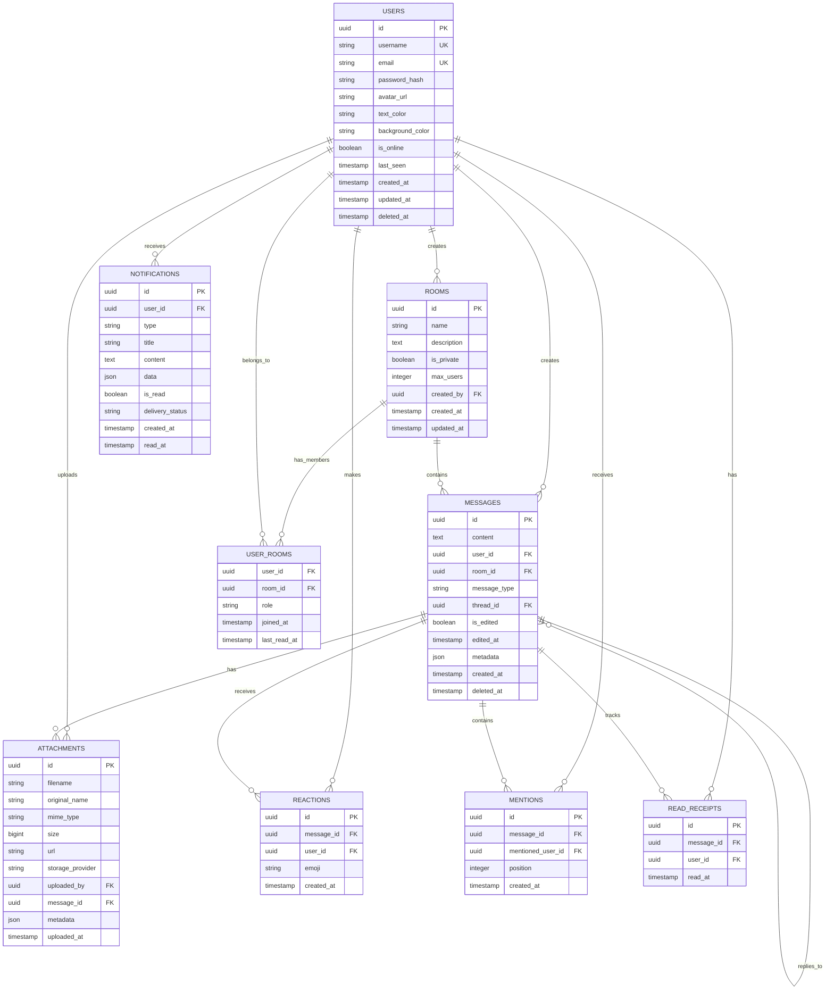

# Chat Rooms Application - Architecture Diagrams

This document contains comprehensive diagrams illustrating the architecture, data flow, and interactions of the Chat Rooms application.

## 1. System Architecture Overview

## 2. Hexagonal Architecture Detail

## 3. Data Flow Diagram

## 4. Database Schema Diagram

## 5. WebSocket Event Flow

## 6. Authentication & Security Flow

## 7. File Upload & Processing Flow

## 8. High Availability Architecture

## 9. Deployment Pipeline Flow

## 10. Monitoring & Observability Architecture

## 11. Frontend Component Architecture

## 12. Security Architecture Diagram

These diagrams provide a comprehensive visual representation of the Chat Rooms application architecture, covering all aspects from high-level system design to detailed component interactions, security measures, and deployment strategies.
